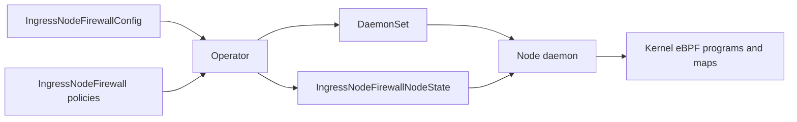

# AGENTS instructions

## Project overview

The Ingress Node Firewall (INF) Operator provides a stateless, eBPF-based firewall for managing node-level ingress traffic in the OpenShift Container Platform.

## Commands

Run `make help` from the repository root to list targets and descriptions including but not limited to build, test and installation of INF.

## Repository structure
```text
├── api/
│   └── v1alpha1/                 CRD types, validation markers, generated deepcopy code
├── bindata/
│   └── manifests/
│       └── daemon/               Runtime DaemonSet and NetworkPolicy templates
├── bpf/                          C packet-processing program and shared structures
│   └── headers/                  Kernel and libbpf headers used for compilation
├── bundle/                       Generated Operator Lifecycle Manager (OLM) bundle
│   ├── manifests/                CRDs, ClusterServiceVersion (CSV), RBAC, services
│   ├── metadata/                 Bundle annotations
│   └── tests/
│       └── scorecard/            Operator SDK scorecard configuration
├── cmd/
│   ├── daemon/                   Node daemon entry point
│   └── syslog/                   Firewall event logging entry point
├── config/                       Kustomize inputs and deployment configuration
│   ├── certmanager/              Certificates and CA injection configuration
│   ├── crd/                      CRD composition
│   │   ├── bases/                Generated CRD schemas
│   │   └── patches/              Webhook and certificate injection patches
│   ├── kind/                     KinD deployment overlay
│   ├── manager/                  Controller Deployment, environment, image settings
│   ├── manifests/                OLM manifest composition
│   │   └── bases/                Base CSV
│   ├── olm-install/              Catalog, subscription, and installation resources
│   ├── openshift/                Direct OpenShift deployment overlay
│   ├── openshift-olm/            OpenShift OLM overlay
│   ├── prometheus/               Monitoring configuration
│   ├── rbac/                     Service accounts, roles, bindings, metrics services
│   ├── samples/                  Example configuration and firewall policies
│   ├── scorecard/                Scorecard composition
│   │   ├── bases/                Base scorecard configuration
│   │   └── patches/              Basic and OLM scorecard test patches
│   └── webhook/                  Admission webhook service and configuration
├── controllers/                 Config, firewall, and node-state reconcilers/tests
├── docs/                        Troubleshooting guide, diagram, and design PDF
├── hack/                        Build, generation, lint, certificate, and KinD scripts
├── manifests/                   OpenShift release/package metadata
│   └── stable/                   Release manifests and image references
├── openshift-ci/                OpenShift deployment and E2E scripts
│   └── ingress-node-firewall-operator-deploy/  OLM installation/index-image tooling
├── pkg/
│   ├── apply/                    Kubernetes resource apply helpers
│   ├── bpf-mgr/                  Optional bpfman integration
│   ├── constants/                Shared constants
│   ├── ebpf/                     BPF loader, events, generated Go bindings and objects
│   ├── ebpfsyncer/                Desired-rule/interface synchronization and tests
│   ├── failsaferules/             Protected kubernetes service ports and rule-count limit
│   ├── interfaces/               Host network-interface helpers
│   ├── metrics/                  BPF statistics polling and Prometheus collectors
│   ├── platform/                 Kubernetes/OpenShift platform detection
│   ├── render/                   Manifest template rendering
│   │   └── testdata/             Rendering fixtures
│   ├── status/                   Operator resource availability/status helpers
│   ├── tls/                      OpenShift TLS security profile handling and tests
│   ├── utils/                    Firewall port and range parsing
│   ├── version/                  Build-time version information
│   └── webhook/                  Firewall admission validation and tests
├── test/                        E2E test cases
│   ├── consts/                   Shared test constants
│   └── e2e/
│       ├── client/               Cluster client setup
│       ├── daemonset/            DaemonSet test helpers
│       ├── deployment/           Deployment test helpers
│       ├── events/               Firewall event assertions
│       ├── exec/                 Pod command execution
│       ├── functional/           Functional Ginkgo suite entry point
│       │   └── tests/            Traffic, rule, metrics, and TLS scenarios
│       ├── icmp/                 ICMP traffic helpers
│       ├── images/               Test image selection
│       ├── ingress-node-firewall/ Firewall custom-resource helpers
│       ├── k8sreporter/           Cluster diagnostic/report collection
│       ├── namespaces/           Namespace helpers
│       ├── node/                 Node and IP-family detection helpers
│       ├── pods/                 Test pod lifecycle helpers
│       ├── tls/                  TLS test helpers
│       ├── transport/            TCP, UDP, and SCTP traffic helpers
│       └── validation/           Installation-validation suite entry point
│           └── tests/            Installation/resource validation scenarios
```

## Architecture Notes

The project has three layers: the operator manages desired state, node daemons
apply it, and eBPF programs enforce it in the kernel.

- **Operator (`main.go`, `controllers/`):** The config controller turns the
  namespaced `IngressNodeFirewallConfig` into a DaemonSet using templates in
  `bindata/manifests/daemon/`. The firewall controller merges cluster-scoped
  `IngressNodeFirewall` policies for matching nodes into one namespaced
  `IngressNodeFirewallNodeState` per node, with rules grouped by interface.
- **Node daemon (`cmd/daemon/daemon.go`):** Runs the node-state controller for its
  own node. It consumes its specific node `IngressNodeFirewallNodeState` and passes
  desired rules to `pkg/ebpfsyncer/` to manage interfaces, program attachments,
  and BPF maps. Finalizers ensure cleanup completes before node-state deletion.
- **Kernel filtering (`bpf/`):** C eBPF programs apply stateless ingress rules.
  The direct loader uses XDP with TCX ingress as a fallback. Go bindings and
  compiled BPF objects live in `pkg/ebpf/`.


